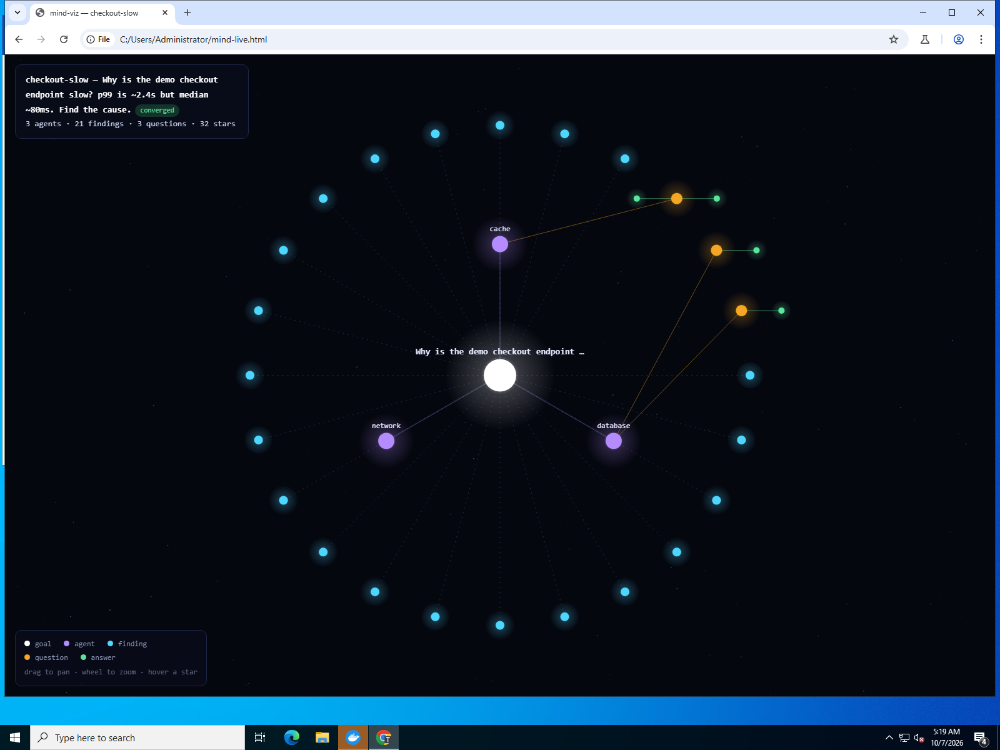

# swarm-md — agent swarms on Agent Memory Repo

`swarm` fans out a team of AI agents that coordinate through plain Markdown —
the **message-board pattern from the [Agent Memory Repo spec](https://cognition.com/agent-memory-repo)** — then renders their shared memory as an **interactive constellation** you can fly through.

```sh
pip install "git+https://github.com/Aws8/swarmi"
```

## Why this exists

Agent Memory Repo (Cognition, Oct 2026) defines how agents share memory:
Markdown notes, `[[wiki-links]]`, and a swarm folder where agents leave each
other findings and questions. The spec shows the pattern — but ships no
runner and no way to *see* the swarm think.

`swarm` is both: declare a swarm, spawn one Devin session per agent role
(via the Devin API), watch the board converge — and export `mind.html`, a
zero-dependency constellation of everything the swarm learned and asked.

## 60 seconds

```sh
swarm new slow-checkout /path/to/memory-repo --goal "why is checkout slow?" --roles database cache network
swarm plan /path/to/memory-repo/swarms/slow-checkout            # dry-run
swarm run  /path/to/memory-repo/swarms/slow-checkout --repo-url https://github.com/you/memory
swarm watch /path/to/memory-repo/swarms/slow-checkout           # poll until converged
swarm viz  /path/to/memory-repo/swarms/slow-checkout            # -> mind.html
swarm report /path/to/memory-repo/swarms/slow-checkout          # -> report.md
```

`run` needs `DEVIN_API_KEY` (or `--api-key`). Everything else is local and
key-free: `plan`, `status`, `viz`, `report`, and `run --dry-run`.

## The board

Each swarm is a spec-compliant folder inside a memory repo:

```
swarms/<name>/
  README.md        goal + rules every agent reads first
  findings.md      measured facts, each with [source: <session url>]
  questions.md     top-level bullets = questions, nested = answers
  agents/<role>.md private notes per agent
  scripts/         shared scripts so every agent measures the same way
```

The swarm **converges** when every question has at least one answer —
`swarm watch` detects it, `swarm report` writes it up.

## mind-viz — watch a swarm think

`swarm viz` renders the board as a single self-contained HTML file:
the goal is the center, agents orbit it, findings/questions/answers are
stars; open questions pulse amber. Hover any star for its text, drag to
pan, scroll to zoom. No dependencies, no network — one file you can
attach anywhere.



## Demo: a real swarm, in this repo

This run actually happened. Three Devin sessions — spawned with
`devin_session_create`, tagged `swarmi-demo` — debugged
`demo/app/server.py`, a checkout server with a planted bug (a price cache
rebuilding its 50k-row table under one lock). Each agent owned an area
(database / cache / network), measured only with the shared
`demo/app/bench.py`, and coordinated through the board at
[`demo/memory-repo/swarms/checkout-slow/`](demo/memory-repo/swarms/checkout-slow/).

What the board recorded:

- **21 findings, 3 questions — converged.** Every finding carries the
  real session URL that measured it.
- **cache** measured the tail and proved it: p99 ~420ms, every slow
  request inside a rebuild window.
- **network** answered cache's follow-up by sweeping concurrency:
  C=16 → connect p99 ~2s — matching the reported 2.4s — via SYN drops
  when the 5-deep accept backlog overflows during a stall. Amplifier,
  not cause.
- **database** ruled out data access, then *verified the fix*: rebuild
  off-lock, swap under lock → tail collapses to p99 17ms.
- cache reviewed the fix on the board — agreed, with the correct caveat
  for dynamic sources.

The sessions:
[database](https://app.devin.ai/sessions/49606b3877994cbc9a1d7162cd86a3ba) ·
[cache](https://app.devin.ai/sessions/84695ccb45b24afb84c4f72317e5cc29) ·
[network](https://app.devin.ai/sessions/8f214f6082a04381b3c3c24a3f9710ca)

Artifacts the swarm left behind:
[`findings.md`](demo/memory-repo/swarms/checkout-slow/findings.md) ·
[`questions.md`](demo/memory-repo/swarms/checkout-slow/questions.md) ·
[`report.md`](demo/memory-repo/swarms/checkout-slow/report.md) ·
[`mind.html`](demo/memory-repo/swarms/checkout-slow/mind.html) (open it)

Replay the viz yourself:

```sh
swarm viz demo/memory-repo/swarms/checkout-slow
```

## How it works

1. `swarm new` scaffolds the board and indexes it in `MEMORY.md`
2. `swarm run` POSTs one session per `agents/<role>.md` to `api.devin.ai/v3`,
   each with a prompt that pins its area, the rules, and the write protocol
3. Agents clone the memory repo, measure with `scripts/`, and coordinate
   through `findings.md` / `questions.md` — git flags any conflicting edit
4. `swarm watch` polls session status + board state until convergence
5. `swarm viz` / `swarm report` turn the board into artifacts

Session state lives in `swarms/<name>/.swarm/sessions.json`.

## Tests

```sh
python -m pytest tests/
```

## License

MIT
